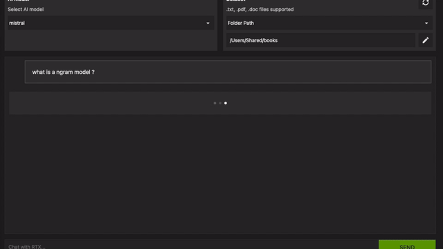

# 🚀 RAG using Ollama and LlamaIndex 🦙

This is a modified version of the https://github.com/NVIDIA/trt-llm-rag-windows.git using Ollama :
- usable on any system able to run Ollama (<b>including "CPU only" mode</b> 🎉)
- is no more limited to Windows : <b>Linux and MacOS</b> supported as well.
- <b>client/server deployment</b> : you can run this python app by connecting to the remote host serving ollama endpoint see [here](#ollama_serve) for details.
- the page numbers are returned along with the reference files.



Chat with RTX is a demo app that lets you personalize a GPT large language model (LLM) connected to your own content—docs, notes, videos, or other data. Leveraging retrieval-augmented generation (RAG), you can query a custom chatbot to quickly get contextually relevant answers. And because it all runs locally on your workstation, you’ll get fast and secure results.

Chat with RTX supports various file formats, including text, pdf, doc/docx, and xml. Simply point the application at the folder containing your files and it'll load them into the library in a matter of seconds. 

### What is RAG? 🔍
Retrieval-augmented generation (RAG) for large language models (LLMs) seeks to enhance prediction accuracy by leveraging an external datastore during inference. This approach constructs a comprehensive prompt enriched with context, historical data, and recent or relevant knowledge.

## Getting Started

### Requirements :
- ollama installed on your local machine (https://ollama.com/)
- llama2 and mistral are predefined as selectable model so they must be installed upfront using ollama pull
```
ollama pull llama2
ollama pull mistral
```
tk must be installed (to allow root dir selection)

On linux :
```
sudo apt-get install python3-tk
```

on MacOs :
```
brew install python-tk@3.10
```

Prerequisites 
- Python 3.10

2. Install requirement.txt
```
pip install -r requirements.txt
```

### Run Ollama + app locally

**Command:**
```
python app.py
```

### <a name="ollama_serve"></a>Run app locally requesting an external ollama inference endpoint

First serve the model on the ollama host (example below for a host running Linux), given the host interface IP address to bind to :
```
OLLAMA_HOST=<host>:11434 OLLAMA_MODELS=/usr/share/ollama/.ollama/models ollama serve
```

You can then use the current app from your workstation without having to run the LLM locally (the vector sore and your documents will be kept local to your workstation)
```
python app.py --base_url http://<host>:11434
```


## Adding your own data
- This app loads data from the dataset / directory into the vector store. To add support for your own data, replace the files in the dataset / directory with your own data. By default, the script uses llamaindex's SimpleDirectoryLoader which supports text files such as .txt, PDF, and so on.


This project requires additional third-party open source software projects as specified in the documentation. Review the license terms of these open source projects before use.
